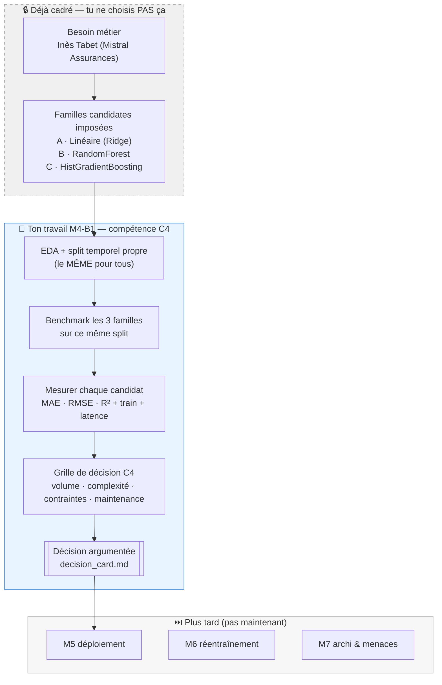

# M4-B1 — Squelette repo (benchmark Mistral Assurances)

> **Repo template GitHub.** Clique sur **« Use this template »** → nomme-le
> `M4-B1-mistral-<prénom>`.

---

## 🚀 Démarrage (4 commandes)

```bash
git clone git@github.com:<ton-user>/M4-B1-mistral-<prenom>.git
cd M4-B1-mistral-<prenom>

python -m venv .venv && source .venv/bin/activate
pip install -r requirements.txt

jupyter notebook notebooks/M4-B1_template.ipynb
```

> 📦 `bike_sharing.csv` est **déjà dans `data/`** (livré avec le template).
> Le lien du **baseline `mistral-tarif-v1`** te sera donné mardi.

---

## 🗺️ Ce que tu fais ce module (et ce qui est déjà cadré)

Avant de coder, situe ton geste. **Choisir un modèle ≠ inventer la liste des
modèles candidats.** Le sourcing des familles est déjà tranché ; ton travail
(compétence **C4**) est **l'arbitrage chiffré et justifié entre ces candidats**.



**Pourquoi ces 3 familles (et pas d'autres) ?** Elles couvrent un **spectre de
complexité croissante** adapté à un tabulaire de taille moyenne : baseline
interprétable → ensemble robuste → boosting performant. Ni deep learning ni
foundation model : ni le volume (~17 k lignes) ni la nature de la donnée ne le
justifient (**sobriété**). Le détail famille par famille (forces / limites) est
dans l'aide-mémoire `ressources-publiques/cheatsheet_algos_ML_FR.pdf` — les 3
familles y sont repérées **« TRIO M4B1 »**. C'est le trajet que la map
scikit-learn *« Choosing the right estimator »* recommande pour ce problème :
le brief l'a fait pour toi ; en M8, tu le feras toi-même.

---

## 📁 Structure du repo

```
M4-B1-mistral-<prenom>/
├── data/
│   └── bike_sharing.csv                  # livré avec le template (versionné)
├── notebooks/
│   └── M4-B1_template.ipynb              # exploration + benchmark
├── src/
│   ├── preprocess.py                     # TODO features + encodage
│   ├── train_models.py                   # boucle benchmark mutualisée
│   └── evaluate.py                       # métriques régression
├── models/                               # gitignored — modèles .joblib
├── ressources/                           # 📚 6 mini-cours
│   ├── README.md
│   ├── 01_EDA_saisonnalite_essentiel.md
│   ├── 02_Split_temporel_vs_stratifie_essentiel.md
│   ├── 03_Metriques_regression_essentiel.md
│   ├── 04_Benchmark_methodologie_essentiel.md
│   ├── 05_Grille_decision_C4_essentiel.md
│   ├── 06_Menaces_robustesse_essentiel.md
│   └── liens_officiels.md
├── benchmark_table.md                    # livrable Inès
├── decision_card.md                      # ta grille perso
├── verdict.md                            # recommandation 5 lignes
├── requirements.txt
├── .gitignore
└── README.md (ce fichier — à compléter)
```

---

## 📚 Mini-cours d'appui

6 mini-cours dans [`./ressources/`](./ressources/), lecture juste-à-temps.

| Tâche | Mini-cours |
|---|---|
| EDA orientée saisonnalité | [`01_EDA_saisonnalite_essentiel.md`](./ressources/01_EDA_saisonnalite_essentiel.md) |
| Split temporel vs stratifié | [`02_Split_temporel_vs_stratifie_essentiel.md`](./ressources/02_Split_temporel_vs_stratifie_essentiel.md) |
| Métriques régression (MAE/RMSE/R²) | [`03_Metriques_regression_essentiel.md`](./ressources/03_Metriques_regression_essentiel.md) |
| Méthodologie benchmark | [`04_Benchmark_methodologie_essentiel.md`](./ressources/04_Benchmark_methodologie_essentiel.md) |
| Grille de décision C4 | [`05_Grille_decision_C4_essentiel.md`](./ressources/05_Grille_decision_C4_essentiel.md) |
| Robustesse et menaces (ouverture M7, non certifiant) | [`06_Menaces_robustesse_essentiel.md`](./ressources/06_Menaces_robustesse_essentiel.md) |

---

## 🧭 Démarche attendue

### Mardi (5 h)

1. Reprise baseline `mistral-tarif-v1` (30 min)
2. EDA orientée saisonnalité (1h30) — mini-cours `01`
3. Split argumenté + CV (30 min) — mini-cours `02`
4. Benchmark 3+ familles (2h) — mini-cours `03` (métriques) + `04` (méthodo)
5. Mur réflexif intermédiaire 16h45 (15 min)

### Mercredi (2h + 1h15 restitution)

6. Tableau comparatif (1h, 9h15-10h15) — mini-cours `04`
7. Verdict + decision_card (30 min, 10h15-10h45) — mini-cours `05` (grille C4)
8. Pause (15 min)
9. Préparation restitution (30 min) — réflexion robustesse : mini-cours `06`
10. **Construction collective grille de décision C4** (11h30-12h45) — mini-cours `05`

→ Compétences visées : **C1 — adapter** + **C2 — adapter** + **C4 — imiter puis adapter**.

---

## ✅ Conventions de code

- Python 3.11+
- Type hints
- Pas de `print`, `pathlib.Path`, `random_state=42`

---

## 🆘 Bloqué·e ?

1. Relis le mini-cours en cours.
2. Si tu doutes entre `KFold` et `TimeSeriesSplit` → mini-cours 02.
3. Si ton R² semble trop beau (> 0.99) → tu utilises **`casual_riders` ou
   `registered_riders` en feature** — c'est une **fuite** ! Retire-les.
4. Discord `fil-M4-B1`.
